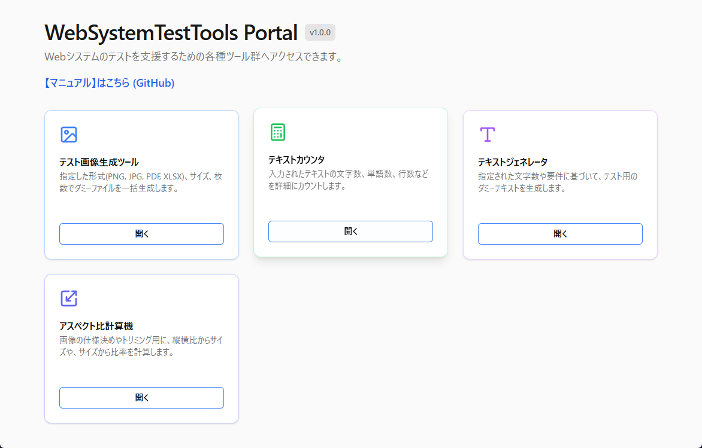

# 🛠️ WebTestTools (ウェブテストツールス)

**🌐 アプリケーションURL:** <a href="https://webtesttools.vercel.app/" target="_blank" rel="noopener noreferrer">https://webtesttools.vercel.app/</a>

**✍️ 開発者ブログ:** <a href="https://unitygamebox.com/" target="_blank" rel="noopener noreferrer">https://unitygamebox.com/</a>

Webシステムの検証や動作確認をサポートするための、便利なツール群をまとめたポータルサイトです。
ブラウザ上から簡単にテスト用データの生成や作業ができ、開発者・テスター・デザイナーの作業効率を向上させます。

---

## ✨ 概要

このプロジェクトは、フロントエンド開発、バックエンド検証、デザインアライメントなどのさまざまなテスト状況で必要となる各種アセットやデータを、ブラウザ上から簡単に生成・取得することを目的としています。

---

## ✨ 利用可能なツール

現在のポータルでは、以下の便利な検証・サポートツールが利用可能です。

### 1. 🖼️ テスト画像生成ツール (Image Generator)
Webサイトのレイアウト検証やアップロード機能のテスト用に、指定した設定でダミーファイルを一括生成してダウンロードできるツールです。

- **対応フォーマット**: PNG, JPG, PDF, XLSX (Excel)
- **主な特徴**:
  - **自由なサイズ指定**: 幅と高さをピクセル単位で自由に指定可能（PDF/Excel以外）
  - **連番付与機能**: 複数枚生成時にファイル名に連番（例: `test_1.png`, `test_2.png`）を自動付与。複数枚の場合はZIPでダウンロード
  - **豊富なサイズプリセット**:
    - バナー (468x60) / スマホバナー (320x50) / リーダーボード (728x90)
    - インラインレクタングル (300x250) / スカイスクレイパー (120x600)
    - HD (1280x720) / フルHD (1920x1080)
    - スマホ向け縦長 (1080x1920) / OGP画像 (1200x630)
  - **カスタマイズ**: 背景色、テキスト色、ボーダー色、フォントサイズの個別設定が可能
- **ダウンロード**: 1枚の場合はその形式のファイル、複数枚の場合はZIP形式で自動的にダウンロードされます。

### 2. 📝 テキストジェネレーター (Text Generator)
テスト用のダミーテキスト（Lorem Ipsumなど）や、文字数制限テスト用のテキストを素早く生成できるツールです。

- **主な特徴**:
  - **多彩な生成モード**: 日本語（吾輩は猫である）、英語（Lorem Ipsum）の文章に加え、ひらがな・カタカナ・英数字のランダム生成に対応
  - **細かなカスタマイズ**: 全角・半角・混在の指定、および改行挿入（文章単位または指定した文字数ごと）の設定が可能
  - **大量生成**: 最大100,000文字までのダミーテキストを一瞬で生成し、ワンクリックでコピー可能

### 3. 📊 テキストカウンター (Text Counter)
入力したテキストの文字数や単語数、行数などをリアルタイムでカウントするツールです。

- **主な特徴**:
  - **リアルタイム計測**: 文字数（空白含む/除外）、行数、単語数を入力と同時に自動計算
  - **容量チェック**: UTF-8エンコーディングでのバイト数（bytes）を表示し、データサイズの確認が可能
  - **効率的な操作**: 入力内容のコピーや一括クリア機能を搭載し、繰り返しの検証作業をサポート

### 4. 📐 アスペクト比計算機 (Aspect Ratio Calculator)
画像のトリミング指示やレスポンシブデザインのコーディング時に役立つ、縦横比の計算ツールです。
- **比率からサイズ計算**: 16:9などの比率と幅(または高さ)を入力すると、もう一方の長さを自動計算します。
- **サイズから比率計算**: 幅と高さを入力すると、その画像の正確な比率を計算します。

---

## 💡 使い方 (ユーザーマニュアル)

1. **ポータルトップ (<a href="https://webtesttools.vercel.app/" target="_blank" rel="noopener noreferrer">https://webtesttools.vercel.app/</a>)** にアクセスします。
2. 利用したいツールを探し、カード内の **「開く」** をクリックして各ツールのページへ移動します。
3. **ツールの操作**:
   - **画像生成**: 形式、サイズ、枚数、色などを設定し、「ファイルを生成」ボタンを押してダウンロードします。
   - **テキスト生成**: 必要な文字数や段落数を指定してテキストを生成し、コピーして使用します。
   - **テキストカウント**: テキストエリアに文字を入力または貼り付けると、自動的に文字数等がカウントされます。
4. 各ページの左上にある戻るボタンやナビゲーションから、いつでもポータルトップに戻ることができます。

---

## 🚫 注意事項

> [!NOTE]
> このツール群は、開発者やテスター向けに提供される内部サポート・検証用アプリケーションです。
> バックエンドへのデータ保存（データベース）等は行っておりませんので、生成データや入力したテキスト内容がサーバーに保存されることは一切ありません。
> 安心してテストデータの生成にご利用ください。

---

## 📄 不具合報告・ご要望

ツールの不具合報告や新機能のご要望は、以下のGitHub Issuesよりお願いいたします。
🔗 <a href="https://github.com/gamebox777/WebTestTools/issues" target="_blank" rel="noopener noreferrer">不具合報告・要望はこちら (GitHub Issues)</a>

---

## 📝 更新履歴
- 2026-02-24: README内の外部リンクを別タブで開くように変更（HTML <a>タグ化）。
- 2026-02-22: READMEの上部に開発者ブログのリンクを追加。
- 2026-02-21: READMEの大見出しタイトルを「WebTestTools (ウェブテストツールス)」に変更。
- 2026-02-21: アプリ本体のURLを上部に明記。最新のツール一覧(Text Generator, Text Counter)の追加と、ユーザーマニュアルとしてREADME全体を再構成。
- 2026-02-21: ツール一覧にアスペクト比計算機 (Aspect Ratio Calculator) を追加。
- 2026-02-21: READMEのポータル画像表示サイズを50%に変更。
